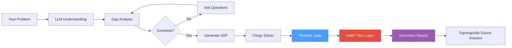

# Savanty — Topologically-Aware Constraint Engine

[](https://pypi.org/project/savanty/)
[](https://pypi.org/project/savanty/)
[](https://github.com/skelf-research/savanty/actions/workflows/ci.yml)
[](https://opensource.org/licenses/MIT)
[](https://github.com/astral-sh/ruff)

> **🚀 Natural language to constraint solver. Describe optimization problems in English, get mathematically guaranteed solutions — now with topological awareness.**

Savanty combines LLM understanding with Answer Set Programming (ASP) to solve scheduling, allocation, and planning problems. The LLM translates your problem into formal constraints; the solver guarantees correctness. Three **la-link** post-processors now make Savanty a **Topologically-Aware Constraint Engine**:

| Layer | What It Does | Origin |
|-------|-------------|--------|
| 🔷 **TernaryL Gate** | Maps solver conviction onto {Sure (+1), Uncertain (0), Impossible (-1)} with a Leminal Zone deadband | Hybrid Manifold |
| 🛡️ **SAEP Veto Layer** | Checks assignments against a 4-tier governance hierarchy (Room → Sector → Portfolio → Market) | SAEP Governance |
| ⚖️ **Symmetry-Skeptic** | Flags solutions that break topological symmetry using Wasserstein distance | TDA Symmetry Detection |

---

## 📐 The la-link Pipeline

```
English ──► LLM ──► ASP ──► TernaryL Gate ──► SAEP Veto ──► Symmetry-Skeptic ──► Topologically-Sound Solution
```



---

## 🛠️ Quickstart

```bash
pip install savanty
export OPENAI_API_KEY=your_key_here
```

```python
from savanty import solve_optimization_problem

result = solve_optimization_problem("""
    Schedule 4 nurses (Alice, Bob, Carol, Dave) for morning/evening shifts
    over 5 days. Each shift needs 1 nurse. Max 4 shifts per person.
""")

print(result.solution)             # The assignment
print(result.asp_code)             # Generated ASP
print(result.ternary_result)       # TernaryL conviction
print(result.veto_result)          # SAEP governance check
print(result.symmetry_result)      # Symmetry-violation report
print(result.topological_scores)   # Aggregate topological scores
```

### CLI

```bash
savanty -p "Assign 5 tasks to 3 workers, balance workload"
```

### Web Server

```bash
savanty --web  # REST API at http://localhost:8000
```

---

## 📚 The Knowledge Path

1. **[How It Works](documentation/docs/concepts/how-it-works.md)** — Understand the full LLM → ASP → Topological pipeline
2. **[Getting Started](documentation/docs/getting-started.md)** — First problem in 5 minutes
3. **[TernaryL Gate](savanty/ternary_l.py)** — Conviction mapping with Leminal Zone
4. **[SAEP Veto Layer](savanty/saep_veto.py)** — Governance heirarchy post-processor
5. **[Symmetry-Skeptic](savanty/symmetry_skeptic.py)** — Topological symmetry-violation detection

---

## 🔷 TernaryL Gate

Every solver assignment gets a **TernaryL trit gate** rating:

| Gate | Value | Meaning |
|------|-------|---------|
| **Sure** | `+1` | Conviction ≥ 0.70 — strong commitment from a large decision space |
| **Uncertain** | `0` | Conviction in (0.30, 0.70) — borderline; warrants human review |
| **Impossible** | `-1` | Conviction ≤ 0.30 — trivially forced or infeasible |

The **Leminal Zone** deadband (0.30–0.70) rejects low-confidence assignments by default, mirroring the Hybrid Manifold's trit gates.

```python
from savanty import TernaryLEngine, LeminalZone

engine = TernaryLEngine(leminal=LeminalZone(low=0.30, high=0.70))
result = engine.evaluate({"n1": "c1", "n2": "c2", "n3": "c3"},
                         domains={"n1": ["c1","c2","c3"], ...})
print(result.aggregate_gate)  # +1 (all Sure)
```

---

## 🛡️ SAEP Veto Layer

The SAEP (Spatial-Aware Ethics Protocol) Veto Layer checks every assignment against a 4-tier governance hierarchy:

| Tier | Scope | Example Constraint |
|------|-------|-------------------|
| 🏠 **Room** | Individual | Max 1 person per seat |
| 🏢 **Sector** | Department | Balanced workload across teams |
| 📊 **Portfolio** | Organisation | Capacity constraints |
| 🌐 **Market** | Ecosystem | No conflict of interest |

```python
from savanty import VetoEngine, SAEPConstraint, SAEPTier

engine = VetoEngine()
engine.add_constraint(
    SAEPConstraint.max_value_constraint(
        tier=SAEPTier.SECTOR,
        name="max_night_shifts",
        pattern="night",
        max_count=10
    )
)
result = engine.check(assignment)
print(result.passed, result.summary)
```

---

## ⚖️ Symmetry-Skeptic

Detects topological symmetry violations: variables that belong to the same symmetry orbit (identical domain + constraint-neighbour structure) but received different values from the solver. Uses an adaptation of **Wasserstein distance** for aggregate measurement.

```python
from savanty import SymmetrySkeptic

skeptic = SymmetrySkeptic()
result = skeptic.check(
    assignment={"n1": "c1", "n2": "c2", "n3": "c1"},
    domains={"n1": ["c1","c2"], "n2": ["c1","c2"], "n3": ["c1","c2"]},
    constraint_edges=[("n1","n2"), ("n2","n3")]
)
print(result.passed)                     # False if asymmetry found
print(result.wasserstein_distance)       # 0.0 = perfect symmetry
```

---

## Installation

```bash
# Core package
pip install savanty

# With desktop GUI
pip install 'savanty[desktop]'

# Development
pip install 'savanty[dev]'
```

**Requirements:** Python 3.10+ and an [OpenAI API key](https://platform.openai.com/api-keys)

## API Reference

### `solve_optimization_problem(problem, additional_info=None)`

Returns a `ProblemSolverResult` with:

| Attribute | Type | Description |
|-----------|------|-------------|
| `solution` | `str` | The solution if found |
| `asp_code` | `str` | Generated ASP program |
| `visualization_html` | `str` | HTML visualization |
| `needs_more_info` | `bool` | True if clarification needed |
| `questions` | `list[str]` | Clarifying questions |
| `error` | `str` | Error message if failed |
| `not_suitable` | `bool` | True if problem doesn't fit ASP |
| `ternary_result` | `TernaryLResult` | TernaryL conviction assessment |
| `veto_result` | `VetoResult` | SAEP governance veto check |
| `symmetry_result` | `SymmetrySkepticResult` | Symmetry-violation detection |
| `topological_scores` | `dict[str, float]` | Aggregate topological metrics |

### Handling Results

```python
result = solve_optimization_problem("Schedule my team")

if result.needs_more_info:
    print("Questions:", result.questions)
    result = solve_optimization_problem(
        "Schedule my team",
        additional_info="5 people, morning/evening shifts, 7 days"
    )

elif result.not_suitable:
    print(f"Try: {result.suggested_tool}")

elif result.error:
    print(f"Error: {result.error}")

else:
    print(result.solution)
    # Check topological scores
    if result.ternary_result:
        print(f"TernaryL gate: {result.ternary_result.aggregate_gate}")
    if result.veto_result and not result.veto_result.passed:
        print(f"SAEP veto: {result.veto_result.summary}")
    if result.symmetry_result and not result.symmetry_result.passed:
        print(f"Symmetry violation: {result.symmetry_result.wasserstein_distance:.3f}")
```

## REST API

```bash
savanty --web --port 8000
```

### Endpoints

**POST /solve**
```bash
curl -X POST http://localhost:8000/solve \
  -H "Content-Type: application/json" \
  -d '{"problem_description": "Assign 3 tasks to 2 workers"}'
```

**GET /health** — Health check
**GET /ready** — Readiness check (verifies API key)

OpenAPI docs at `/docs` when server is running.

## What It Solves

Savanty excels at **discrete constraint satisfaction**:

| Good Fit | Not a Good Fit |
|----------|----------------|
| Shift scheduling | Continuous optimization |
| Task assignment | Machine learning |
| Route planning | Statistical analysis |
| Resource allocation | Real-time streaming |
| Seating arrangements | Simple arithmetic |
| Timetabling | |

When a problem doesn't fit, Savanty tells you and suggests alternatives (scipy, sklearn, etc.).

## Configuration

```bash
# Required
export OPENAI_API_KEY=sk-...

# Optional
export SAVANTY_LLM_MODEL=openai/gpt-4o    # Default model
export SAVANTY_PORT=8000                   # Web server port
export SAVANTY_LOG_LEVEL=INFO              # DEBUG, INFO, WARNING, ERROR
export SAVANTY_SOLVE_TIMEOUT=120           # Timeout in seconds
```

See [.env.example](.env.example) for all options.

## Development

```bash
git clone https://github.com/skelf-research/savanty.git
cd savanty
uv sync --extra dev

# Run tests
uv run pytest

# Lint
uv run ruff check .
uv run ruff format .

# Run locally
uv run savanty --web
```

### Project Structure

```
savanty/
├── savanty/
│   ├── solver.py              # Core solver logic
│   ├── ternary_l.py           # Ternary-Continuous Hybrid (TernaryL Gate)
│   ├── saep_veto.py           # SAEP Governance Veto Layer
│   ├── symmetry_skeptic.py    # Topological Symmetry-Violation Detector
│   ├── dspy_modules.py        # LLM prompts (DSPy signatures)
│   ├── cli.py                 # CLI + FastAPI server
│   └── logging_config.py      # Logging setup
├── frontend/                  # Vue.js web interface
├── desktop/                   # Slint desktop app
├── tests/
└── documentation/             # MkDocs site
```

## Tech Stack

- **[Clingo](https://potassco.org/clingo/)** — ASP solver (correctness guarantee)
- **[DSPy](https://github.com/stanfordnlp/dspy)** — LLM orchestration
- **[FastAPI](https://fastapi.tiangolo.com/)** — REST API
- **[Vue.js](https://vuejs.org/)** — Web frontend
- **[Slint](https://slint.dev/)** — Desktop GUI

## License

MIT — see [LICENSE](LICENSE)

## Links

- [Documentation](https://docs.skelfresearch.com/savanty)
- [PyPI](https://pypi.org/project/savanty/)
- [GitHub](https://github.com/skelf-research/savanty)
- [Issues](https://github.com/skelf-research/savanty/issues)
