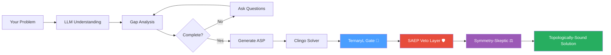

# How Savanty Works

Savanty combines the natural language understanding of large language models (LLMs) with the mathematical rigor of Answer Set Programming (ASP) to solve optimization problems. Three **la-link** post-processors now make Savanty a **Topologically-Aware Constraint Engine**.

## The Pipeline



## Stage 1: Problem Understanding

When you submit a problem, Savanty's LLM (GPT-4o by default) analyzes it to:

1. **Identify entities** - People, tasks, time slots, resources
2. **Extract constraints** - Rules that must be satisfied
3. **Determine objectives** - What to optimize (minimize cost, balance workload, etc.)
4. **Recognize problem type** - Scheduling, allocation, routing, etc.

### Example

Input:
> "Schedule 4 nurses for morning and evening shifts over 5 days. Each shift needs exactly 1 nurse. No one works more than 4 shifts."

Extracted:
- **Entities:** nurses (4), shifts (morning, evening), days (5)
- **Constraints:** exactly 1 nurse per shift, max 4 shifts per nurse
- **Objective:** find a feasible schedule

## Stage 2: Suitability Check

Not every problem is right for ASP. Savanty checks whether your problem fits:

**Good fit for ASP:**
- Discrete choices (assign, schedule, select)
- Combinatorial constraints (exactly one, at most, forbidden pairs)
- Finding any/all valid solutions
- Optimization over discrete options

**Not a good fit:**
- Continuous optimization (derivatives, gradients)
- Statistical analysis
- Simple arithmetic
- Real-time streaming data

If your problem isn't suitable, Savanty suggests alternative tools.

## Stage 3: Gap Identification

The LLM identifies missing information needed to formulate a complete problem:

- "How many days should the schedule cover?"
- "What are the workers' names?"
- "Is there a maximum workload per person?"

You provide answers, and Savanty continues.

## Stage 4: ASP Generation

The LLM generates an Answer Set Program encoding your problem:

```prolog
% Entities (facts)
nurse(alice). nurse(bob). nurse(carol). nurse(dave).
shift(morning). shift(evening).
day(1..5).

% Decision variable: assignment
{ assign(N, D, S) } :- nurse(N), day(D), shift(S).

% Constraint: exactly 1 nurse per shift per day
:- day(D), shift(S), not 1 { assign(N, D, S) : nurse(N) } 1.

% Constraint: max 4 shifts per nurse
:- nurse(N), #count { D,S : assign(N, D, S) } > 4.
```

## Stage 5: Clingo Solving

The generated program is sent to [Clingo](https://potassco.org/clingo/), a state-of-the-art ASP solver:

1. **Grounding:** Expands rules into propositional logic
2. **Solving:** Uses SAT-based algorithms to find solutions
3. **Optimization:** If objectives exist, finds optimal solutions

Clingo guarantees:
- Solutions satisfy ALL constraints
- If no solution exists, reports unsatisfiable
- For optimization, finds the provably best solution

If the solver fails, Savanty's **self-repair loop** kicks in: it builds typed diagnostics (syntax error location, minimal UNSAT core) and asks the LLM to repair the encoding.

## Stage 6: TernaryL Gate (🔷 la-link)

Every solver assignment passes through the **TernaryL Gate**, which maps conviction scores onto the trit-gate space:

| Gate | Value | Meaning |
|------|-------|---------|
| **Sure** | `+1` | Conviction ≥ 0.70 — strong commitment from a large decision space |
| **Uncertain** | `0` | Conviction in (0.30, 0.70) — borderline; warrants human review |
| **Impossible** | `-1` | Conviction ≤ 0.30 — trivially forced or infeasible |

The **Leminal Zone** deadband (0.30–0.70) rejects low-confidence assignments. This prevents the solver from presenting solutions where decisions are forced or ambiguous.

The aggregate gate for the entire solution is:
- **SURE** if every individual assignment is Sure
- **IMPOSSIBLE** if any assignment is Impossible
- **UNCERTAIN** otherwise

**Example:** In a 4-nurse schedule where each nurse is assigned from 10+ options, the TernaryL Gate assigns **Sure (+1)** — high conviction. If one shift has only one eligible nurse (trivially forced), that assignment gets **Impossible (-1)** and the solution is flagged.

## Stage 7: SAEP Veto Layer (🛡️ la-link)

After the TernaryL Gate, solutions are checked against a **4-tier governance hierarchy**:

| Tier | Scope | Example |
|------|-------|---------|
| 🏠 **Room** | Individual constraint | "No single worker exceeds 4 shifts" |
| 🏢 **Sector** | Department-level | "No team exceeds 20 total shifts" |
| 📊 **Portfolio** | Cross-team | "Balanced workload across all teams" |
| 🌐 **Market** | Ecosystem-wide | "No conflict of interest across orgs" |

Constraints are registered as callable predicates. If **any** constraint in any tier is violated, the veto layer records the specific tier, constraint name, and violation message. The `VetoResult` includes:
- `passed`: True if all constraints pass
- `vetoes`: List of specific veto events
- `highest_offending_tier`: The highest-priority tier that raised a veto
- `summary`: Human-readable report

The VetoEngine supports three built-in constraint factories:
- **`max_value_constraint`** — limits how many variables can match a value pattern
- **`unique_value_constraint`** — ensures specified variables get distinct values
- **`custom_constraint`** — for fully arbitrary governance logic

## Stage 8: Symmetry-Skeptic (⚖️ la-link)

The final topological check detects **symmetry violations** in the solver's assignment.

**How it works:**

1. **Orbit Detection** — Variables are grouped into symmetry orbits based on:
   - Same domain (allowed values)
   - Same constraint-neighbour structure (degree and adjacency)

2. **Symmetry Check** — All variables in the same orbit must receive the same value from the solver. If they differ, a symmetry violation is flagged.

3. **Wasserstein Distance** — A continuous aggregate measure:
   - **0.0 = Perfect symmetry** — all orbits are uniform
   - **> 0.0 = Symmetry breaking** — some orbits have mixed values

**Why it matters:**

In many optimization problems (graph coloring, task assignment, shift scheduling), variables that are topologically identical should receive the same treatment unless forced by constraints. If the solver produces an asymmetric solution where a symmetric one exists, the solution is suboptimal or misleading.

**Example:** In a graph coloring problem with three identical nodes (same edges, same domain), if the solver assigns different colors to two symmetric nodes, the Symmetry-Skeptic flags it with a Wasserstein distance > 0.

## Why This Approach

### LLM Strengths
- Understands natural language descriptions
- Handles ambiguity and context
- Adapts to different problem domains
- Provides helpful clarification questions

### ASP Strengths
- **Correctness:** Mathematical proof that all constraints are met
- **Completeness:** Finds solutions if they exist
- **Optimality:** Proves solutions are optimal
- **Explainability:** The logic program shows exactly what was solved

### la-link Topological Strengths
- **TernaryL Gate** — Prevents low-confidence or forced assignments from passing silently
- **SAEP Veto** — Embeds real-world governance into constraint solving
- **Symmetry-Skeptic** — Catches subtle symmetry-breaking that indicates suboptimal solutions

### Combined Benefits
- Easy input (natural language)
- Guaranteed correct output (ASP solver)
- Topologically verified (TernaryL + SAEP + Symmetry)
- Transparent reasoning (viewable ASP code)

## Technical Details

### Libraries Used

- **DSPy:** Orchestrates LLM interactions with structured prompts
- **Clorm:** Python bindings for Clingo ASP solver
- **OpenAI API:** Access to GPT-4o language model

### Hybrid Manifold Modules

- **`ternary_l.py`** — TernaryL Gate with Leminal Zone deadband
- **`saep_veto.py`** — 4-tier SAEP governance hierarchy
- **`symmetry_skeptic.py`** — Topological symmetry-violation detection

### Model Configuration

Default: `openai/gpt-4o`

Configurable via `SAVANTY_LLM_MODEL` environment variable.

### Solver Behavior

- Default timeout: 120 seconds
- Returns first optimal solution found
- For satisfiability (no optimization), returns first valid solution
- Post-processing: TernaryL → SAEP Veto → Symmetry-Skeptic (configurable via `enable_topological_post`)
