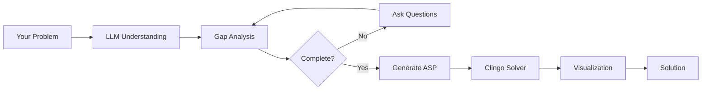

# How Savanty Works

Savanty combines the natural language understanding of large language models (LLMs) with the mathematical rigor of Answer Set Programming (ASP) to solve optimization problems.

## The Pipeline



## Stage 1: Problem Understanding

When you submit a problem, Savanty's LLM (GPT-4o by default) analyzes it to:

1. **Identify entities** - People, tasks, time slots, resources
2. **Extract constraints** - Rules that must be satisfied
3. **Determine objectives** - What to optimize (minimize cost, balance workload, etc.)
4. **Recognize problem type** - Scheduling, allocation, routing, etc.

### Example

Input:
> "Schedule 4 nurses for morning and evening shifts over 5 days. Each shift needs exactly 1 nurse. No one works more than 4 shifts."

Extracted:
- **Entities:** nurses (4), shifts (morning, evening), days (5)
- **Constraints:** exactly 1 nurse per shift, max 4 shifts per nurse
- **Objective:** find a feasible schedule

## Stage 2: Suitability Check

Not every problem is right for ASP. Savanty checks whether your problem fits:

**Good fit for ASP:**
- Discrete choices (assign, schedule, select)
- Combinatorial constraints (exactly one, at most, forbidden pairs)
- Finding any/all valid solutions
- Optimization over discrete options

**Not a good fit:**
- Continuous optimization (derivatives, gradients)
- Statistical analysis
- Simple arithmetic
- Real-time streaming data

If your problem isn't suitable, Savanty suggests alternative tools.

## Stage 3: Gap Identification

The LLM identifies missing information needed to formulate a complete problem:

- "How many days should the schedule cover?"
- "What are the workers' names?"
- "Is there a maximum workload per person?"

You provide answers, and Savanty continues.

## Stage 4: ASP Generation

The LLM generates an Answer Set Program encoding your problem:

```prolog
% Entities (facts)
nurse(alice). nurse(bob). nurse(carol). nurse(dave).
shift(morning). shift(evening).
day(1..5).

% Decision variable: assignment
{ assign(N, D, S) } :- nurse(N), day(D), shift(S).

% Constraint: exactly 1 nurse per shift per day
:- day(D), shift(S), not 1 { assign(N, D, S) : nurse(N) } 1.

% Constraint: max 4 shifts per nurse
:- nurse(N), #count { D,S : assign(N, D, S) } > 4.
```

## Stage 5: Clingo Solving

The generated program is sent to [Clingo](https://potassco.org/clingo/), a state-of-the-art ASP solver:

1. **Grounding:** Expands rules into propositional logic
2. **Solving:** Uses SAT-based algorithms to find solutions
3. **Optimization:** If objectives exist, finds optimal solutions

Clingo guarantees:
- Solutions satisfy ALL constraints
- If no solution exists, reports unsatisfiable
- For optimization, finds the provably best solution

## Stage 6: Visualization

The raw solution (a set of facts) is transformed into a human-readable format:

- Tables for schedules
- Lists for assignments
- Charts for resource allocation

The LLM generates HTML visualization tailored to your problem type.

## Why This Approach?

### LLM Strengths
- Understands natural language descriptions
- Handles ambiguity and context
- Adapts to different problem domains
- Provides helpful clarification questions

### ASP Strengths
- **Correctness:** Mathematical proof that all constraints are met
- **Completeness:** Finds solutions if they exist
- **Optimality:** Proves solutions are optimal
- **Explainability:** The logic program shows exactly what was solved

### Combined Benefits
- Easy input (natural language)
- Guaranteed correct output (ASP solver)
- Transparent reasoning (viewable ASP code)

## Technical Details

### Libraries Used

- **DSPy:** Orchestrates LLM interactions with structured prompts
- **Clorm:** Python bindings for Clingo ASP solver
- **OpenAI API:** Access to GPT-4o language model

### Model Configuration

Default: `openai/gpt-4o`

Configurable via `SAVANTY_LLM_MODEL` environment variable.

### Solver Behavior

- Default timeout: 120 seconds
- Returns first optimal solution found
- For satisfiability (no optimization), returns first valid solution
